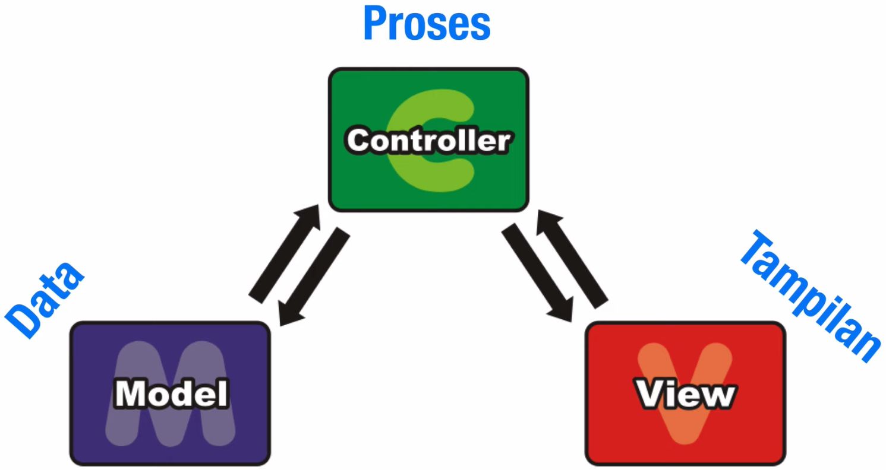
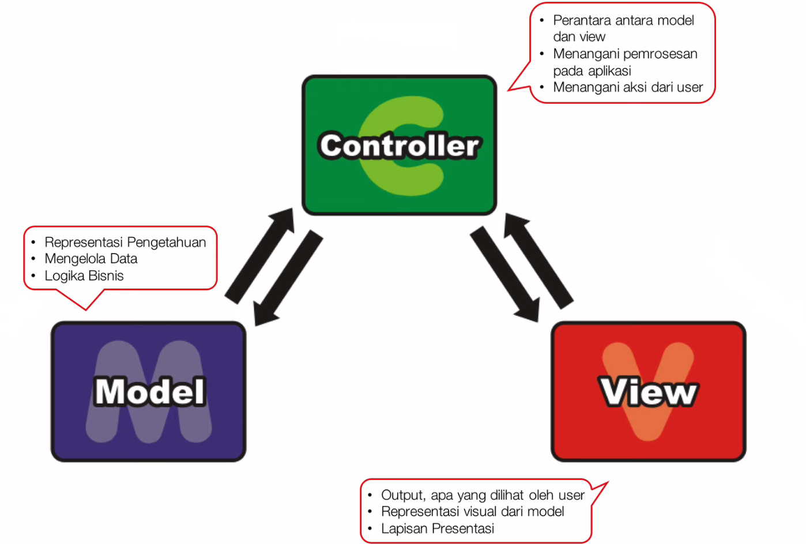
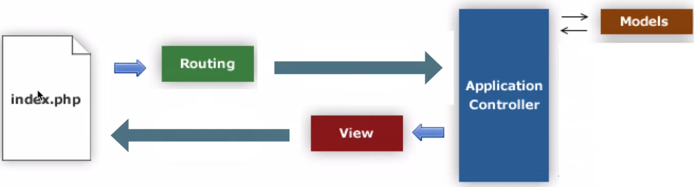

# PHP MVC (Model - View - Controller)
- MVC merupakan pola arsitektur pada perancangan perangkat lunak berorientasi objek (OOP). 
- Tujuan utamanya untuk memisahkan antara data dan proses.

---

## Application Flow pada project ini:
